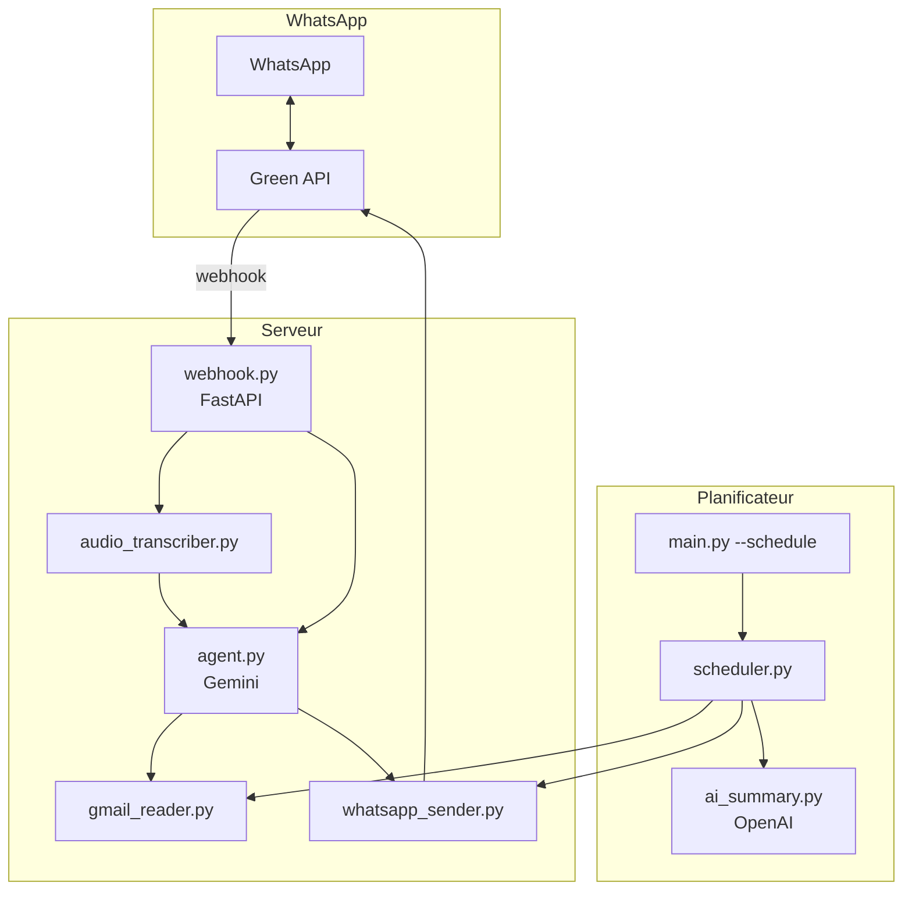

# AI Personal Assistant

Assistant personnel intelligent qui connecte **Gmail**, **WhatsApp** (Green API) et **Gemini** pour lire vos emails, répondre à vos messages et exécuter des actions en langage naturel — y compris via **messages vocaux en français**.

---

## Fonctionnalités

### Mode conversationnel (WhatsApp en temps réel)

- Réception des messages texte et vocaux via webhook Green API
- **Transcription automatique** des notes vocales (Gemini)
- Agent IA avec décisions structurées : réponse directe, escalade ou action
- Double profil : **propriétaire** (accès complet) / **contacts externes** (limité + escalade)
- Commande propriétaire `/repondre` pour répondre manuellement à un client

### Mode planifié (résumés email)

- Lecture des emails Gmail non lus (OAuth2)
- Analyse et résumé par priorité (OpenAI)
- Envoi automatique du résumé sur WhatsApp
- Planification flexible : intervalle, matin, soir, ou custom

### Actions disponibles (propriétaire)

| Service   | Tâche            | Description                          |
|-----------|------------------|--------------------------------------|
| `gmail`   | `send_email`     | Envoyer un email                     |
| `gmail`   | `read_emails`    | Lire les derniers emails non lus     |
| `whatsapp`| `send_message`   | Envoyer un message WhatsApp          |
| `other`   | `search_contact` | Rechercher un contact (base locale) |

---

## Architecture



**Principe clé :** Gemini décide (*reply*, *escalation*, *action*), le backend exécute les actions via les APIs réelles. L’assistant ne confirme jamais une action non exécutée.

---

## Prérequis

- Python 3.11+
- Compte [Google Cloud](https://console.cloud.google.com/) (API Gmail activée)
- Compte [Green API](https://green-api.com/) (instance WhatsApp connectée)
- Clé API [Google Gemini](https://aistudio.google.com/apikey)
- Clé API [OpenAI](https://platform.openai.com/) (pour les résumés email planifiés)

---

## Installation

### 1. Cloner et préparer l’environnement

```bash
cd "AI personnal"
python3 -m venv venv
source venv/bin/activate
pip install -r requirements.txt
```

### 2. Configurer les variables d’environnement

```bash
cp .env.example .env
```

Éditez `.env` avec vos valeurs (voir tableau ci-dessous).

### 3. Configurer Gmail (OAuth2)

1. Créez un projet sur [Google Cloud Console](https://console.cloud.google.com/)
2. Activez l’**API Gmail**
3. Créez des identifiants OAuth2 (application de bureau)
4. Téléchargez `credentials.json` à la racine du projet
5. Lancez une première authentification :

```bash
python main.py --status
```

Un navigateur s’ouvre pour autoriser l’accès. Le fichier `token.json` est généré automatiquement.

### 4. Configurer Green API (WhatsApp)

1. Créez une instance sur [console.green-api.com](https://console.green-api.com/)
2. Connectez WhatsApp (QR code)
3. Activez **« Recevoir les notifications des messages et fichiers entrants »**
4. Configurez l’URL du webhook vers votre serveur :

```
https://votre-domaine.com/webhook
```

En local, utilisez [ngrok](https://ngrok.com/) ou similaire :

```bash
ngrok http 8000
# Puis collez l’URL HTTPS + /webhook dans la console Green API
```

---

## Configuration (`.env`)

| Variable | Obligatoire | Description |
|----------|-------------|-------------|
| `GEMINI_API_KEY` | Oui | Clé API Google Gemini (agent + transcription vocale) |
| `TRANSCRIPTION_MODEL` | Non | Modèle pour les vocaux (défaut : `gemini-2.5-flash`) |
| `GREEN_API_URL` | Oui | URL de l’API Green (ex. `https://7107.api.greenapi.com`) |
| `ID_INSTANCE` | Oui | ID de l’instance Green API |
| `API_TOKEN_INSTANCE` | Oui | Token de l’instance Green API |
| `PHONE_NUMBER` | Oui | Numéro WhatsApp de l’instance (sans `+`) |
| `OWNER_PHONE` | Oui | Votre numéro (propriétaire, mêmes privilèges) |
| `OPENAI_API_KEY` | Planificateur | Clé OpenAI pour les résumés email |
| `SCHEDULE_MODE` | Non | `interval`, `daily_morning`, `daily_evening`, `custom` |
| `SCHEDULE_INTERVAL_MINUTES` | Non | Intervalle en minutes (mode `interval`) |
| `SCHEDULE_MORNING_TIME` | Non | Heure matin `HH:MM` |
| `SCHEDULE_EVENING_TIME` | Non | Heure soir `HH:MM` |
| `MAX_EMAILS` | Non | Emails max par cycle (défaut : 10) |
| `GMAIL_LABELS` | Non | Libellés Gmail (défaut : `INBOX`) |
| `PORT` | Non | Port du webhook (défaut : 8000) |

---

## Utilisation

### Webhook WhatsApp (conversation en temps réel)

```bash
python webhook.py
```

Le serveur démarre sur `http://0.0.0.0:8000`. Endpoint webhook : `POST /webhook`

### Agent en ligne de commande (test propriétaire)

```bash
python agent.py
```

### Résumés email

```bash
# Un cycle unique : Gmail → IA → WhatsApp
python main.py

# Planificateur automatique
python main.py --schedule

# Vérifier les connexions
python main.py --status

# Tester les modules
python main.py --test
```

### Docker

```bash
docker compose up -d
```

Deux services :

- **agent-webhook** — port `8000`, conversation WhatsApp
- **agent-scheduler** — résumés email planifiés

---

## Messages vocaux

1. Vous envoyez un vocal WhatsApp en français
2. Le bot répond : *« Message vocal reçu, transcription en cours... »*
3. Le fichier est téléchargé via Green API
4. Gemini transcrit l’audio
5. L’agent traite le texte et répond

Les vocaux sont transmis à l’agent avec le préfixe `[Message vocal]`.

---

## Commandes propriétaire

### Répondre à un client après escalade

```
/repondre 22890123456 : Bonjour, voici la réponse à votre question.
```

Le numéro peut être avec ou sans `@c.us`. Le client reçoit le message et vous recevez une confirmation.

---

## Comportement de l’agent

| Type | Quand | Résultat |
|------|-------|----------|
| `reply` | Question simple, confiance élevée | Réponse directe |
| `escalation` | Données sensibles, doute, validation requise | Notification au propriétaire |
| `action` | Tâche exécutable (email, WhatsApp, contact) | Exécution API + confirmation réelle |

**Sujets toujours escaladés :** mots de passe, RIB, IBAN, cartes bancaires, virements, etc.

**Contacts externes :** pas d’accès Gmail ; leurs demandes sensibles sont transmises au propriétaire.

---

## Structure du projet

```
.
├── agent.py              # Moteur IA (Gemini, décisions JSON, actions)
├── audio_transcriber.py  # Téléchargement + transcription des vocaux
├── webhook.py            # Serveur FastAPI (webhook Green API)
├── whatsapp_sender.py    # Envoi WhatsApp via Green API
├── gmail_reader.py       # Lecture / envoi Gmail (OAuth2)
├── ai_summary.py         # Résumés email (OpenAI)
├── scheduler.py          # Planification des cycles email
├── main.py               # CLI (cycle unique, planificateur, tests)
├── docker-compose.yml
├── Dockerfile
├── requirements.txt
├── credentials.json      # OAuth2 Google (à fournir)
├── token.json            # Token Gmail (généré automatiquement)
└── .env                  # Secrets (non versionné)
```

---

## Sécurité

- Ne commitez **jamais** `.env`, `credentials.json` ni `token.json`
- Ces fichiers sont listés dans `.gitignore`
- Limitez l’accès au webhook (HTTPS obligatoire en production)
- Le numéro `OWNER_PHONE` est le seul canal avec privilèges complets
- Les actions sensibles sont bloquées ou escaladées automatiquement

---

## Dépannage

| Problème | Piste de solution |
|----------|-------------------|
| Webhook ignoré | Vérifier l’URL dans Green API, HTTPS, notifications activées |
| Vocal non transcrit | Vérifier `GEMINI_API_KEY`, logs `audio_transcriber` |
| Gmail erreur | Relancer `python main.py --status`, régénérer `token.json` |
| Boucle de messages | L’anti-boucle ignore les messages envoyés par l’instance |
| Groupes ignorés | Comportement voulu : seuls les chats privés sont traités |

Logs du webhook : sortie console avec préfixes `[WEBHOOK]`, `[AGENT]`, `[AUDIO]`.

---

## Licence

Projet personnel — usage privé.
